# Simple switch "PJVS Short MUX"

Two BNC inputs switch between BNC outputs:

```ascii
     ──●                             ──●            
Input1   ╲                      Input1              
     ──●  ╲                          ──●            
         ╲  ●──                             ●──     
          ╲   Output                      ╱   Output
            ●──                          ╱  ●──     
     ──●                             ──●  ╱         
Input2                          Input2   ╱          
     ──●                             ──●            
```

Actual required connection for sub-sampling with Device Under Test (DUT, i.e. AC source), Programmable Josephson Voltage Standard (PJVS) and digitizer:

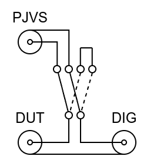

To keep the short as short as possible, one input is shorted directly on the PCB.

This simple switch realize both "Switch" and "Box" in the PTB setup, as presented in paper [R. Behr and L. Palafox, ‘An AC quantum voltmeter for frequencies up to 100 kHz using sub-sampling’, Metrologia, vol. 58, no. 2, p. 025010, Mar. 2021, doi: 10.1088/1681-7575/abe453.](https://iopscience.iop.org/article/10.1088/1681-7575/abe453):

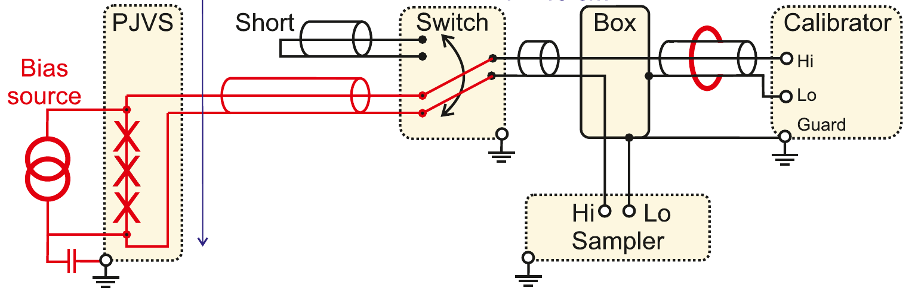

## Properties

- Controlled by:
  - DC signal >= 2.5 V
  - AC signal > 3 V peak-to-peak, frequency bandwidth larger than 10 MHz.
  - Manual control
- Can be controlled directly by National Instruments 5922 digitizer when using
10 MHz external clock. The clock is driven to PFI output on the digitizer and
used as AC signal to switch the relay.
- Input control signal is decoupled from rest of the circuit by an
opto-coupler.
- Powered by lithium 9 V battery that should last 17 years in idle mode.
- Bistable switching relay is double-pole, so the resistance should be very low.
- Two pieces of the switching relays can be mounted, however the
break-before-make will not be guaranteed and two relays are not suitable for
PJVS operation!
- Shielded part with AC control input to prevent interference with the rest of PCB.

The AC or DC control works only if the manual control switch is opened.

Print handle on 3D printer using [STL file](handle/handle.stl) and put it on
the BNC connectors on the side of digitizer for easier connecting to the
digitizer.

## Bill of materials

link | count    | note
---|---|---
[BAT-6F22-LT/GP](https://www.tme.eu/en/details/bat-6f22-lt_gp/batteries/gp/crv9-gp-b1/)    | 1  | any 9V battery, preferably lithium
[BS-ICCOMF-6F22](https://www.tme.com/in/en/details/bs-ic/batteries-containers-and-holders/comf/)    | 1  | 9 V battery connector
[EEUFC1C121](https://www.tme.com/in/en/details/eeufc1c121/tht-electrolytic-capacitors/panasonic/)        | 10 | C electrolyte 120u/16V d6.3mm
[EEUFR1E221](https://www.tme.com/in/en/details/eeufr1e221/tht-electrolytic-capacitors/panasonic/)        | 10 | C electrolyte 220u/25V d8mm low ESR
[G6KU-2F-Y-5DC](https://www.tme.com/in/en/details/g6ku-2f-y-5dc/miniature-electromagnetic-relays/omron-electronic-components/g6ku-2f-y-5vdc/)     | 1  | relay bistable 5V
[HM-1590B3](https://www.tme.com/in/en/details/hm-1590b3/multipurpose-enclosures/hammond/1590b3/)         | 1  | metal box
[7401SYZQE](https://www.tme.eu/en/details/7401syzqe/toggle-switches/c-k/)         | 1  | manual switch 4PDT
[PK10ASW](https://www.tme.com/in/en/katalog/?queryPhrase=PK10ASW)           | 1  | post 4mm earth
[031-10-RFXG1](https://www.tme.com/in/en/details/031-10-rfxg1/bnc-connectors/amphenol-rf/)      | 4  | BNC female isolated, panel mount
.                   | 2  | BNC male, panel mount
OK1 FOD817E         | 1  | opto-coupler PC817
Q1 BCV65            | 1  | general-purpose transistor BCV62
C 100p              | 1  | C EU025-024X044
C 1n                | 2  | C EUC0805K
C 100n              | 2  | C EUC0805K
D1 BAS40-04         | 1  | BAS40-04
D2 BAS32            | 1  | BAS32
IC1 40106D          | 1  | 40106D
R 4M7               | 1  | R EU_0207
R 1k                | 1  | R EU_R0805
R 51                | 2  | R EU_R0805
R 100               | 1  | R EU_R0805
R 2k2               | 2  | R EU_R0805
R 10k               | 1  | R EU_R0805

## Photos

### Soldered PCB

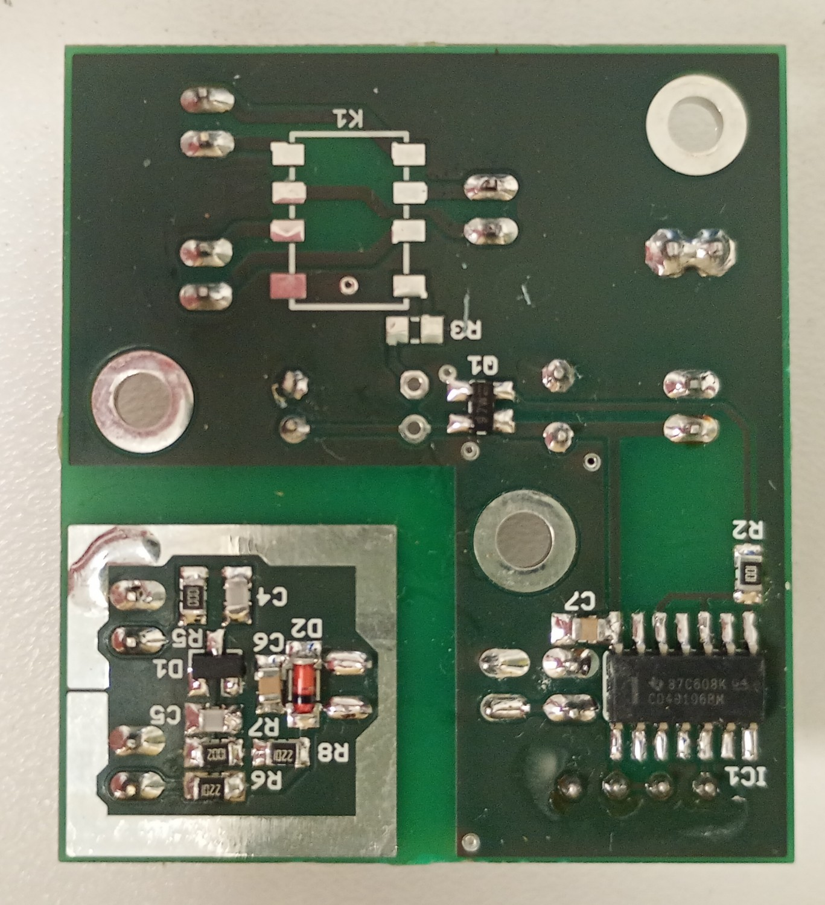
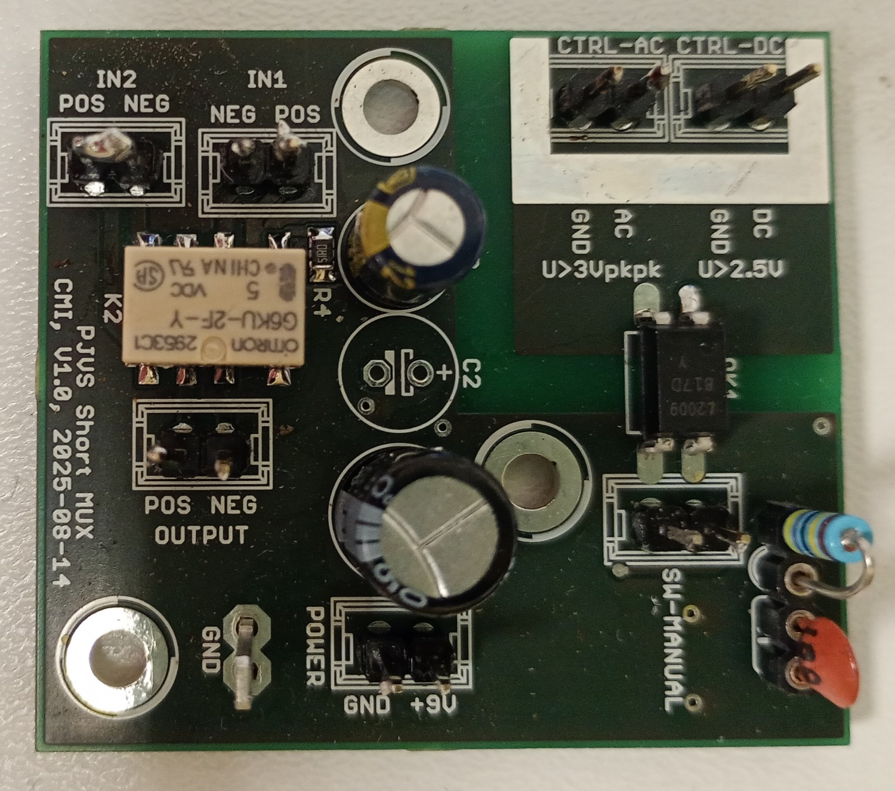

### HF shield

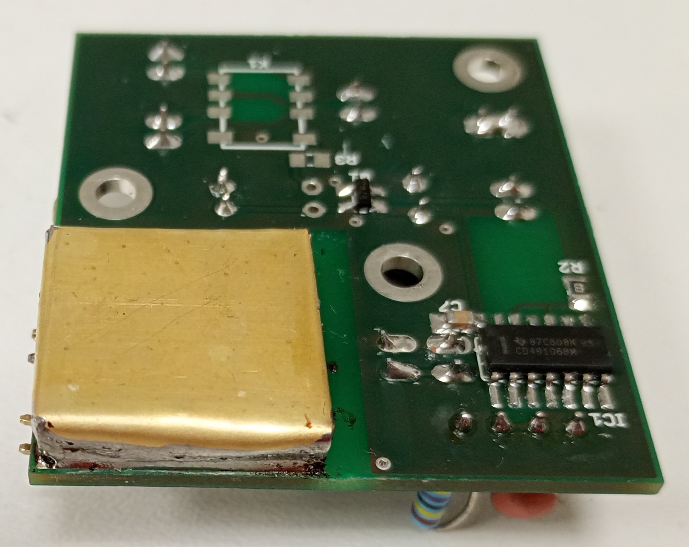
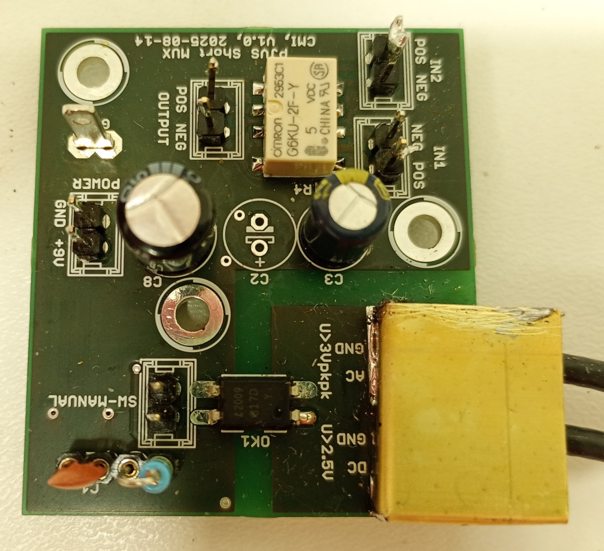
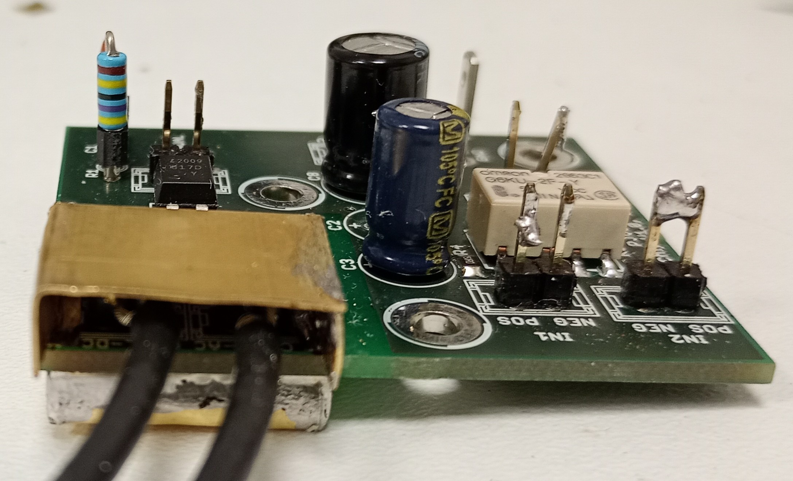

### Switch in the case

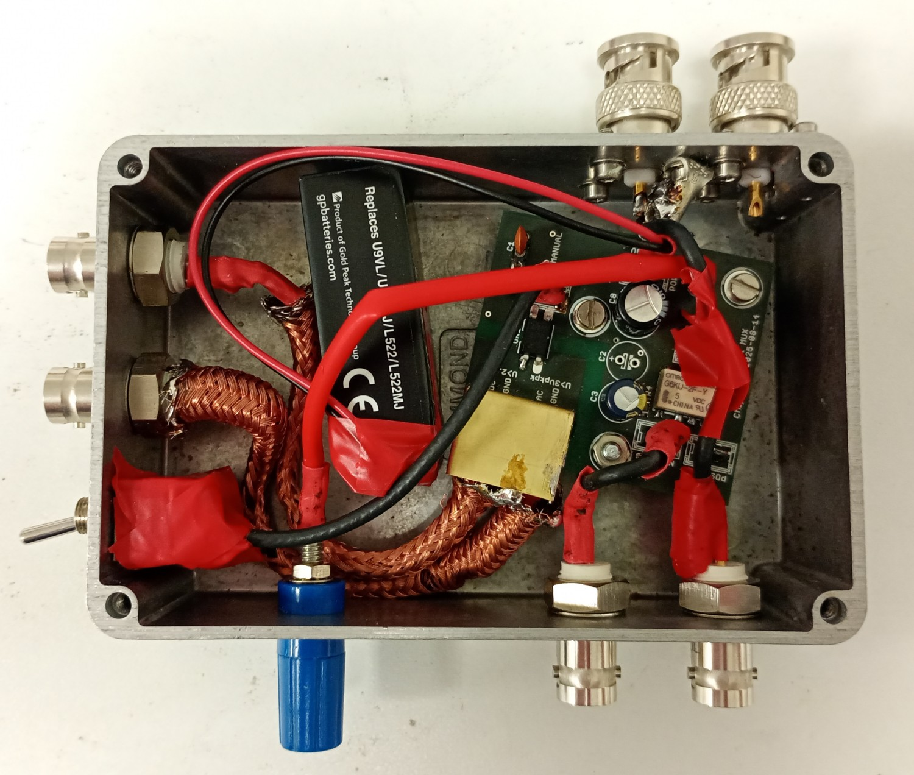
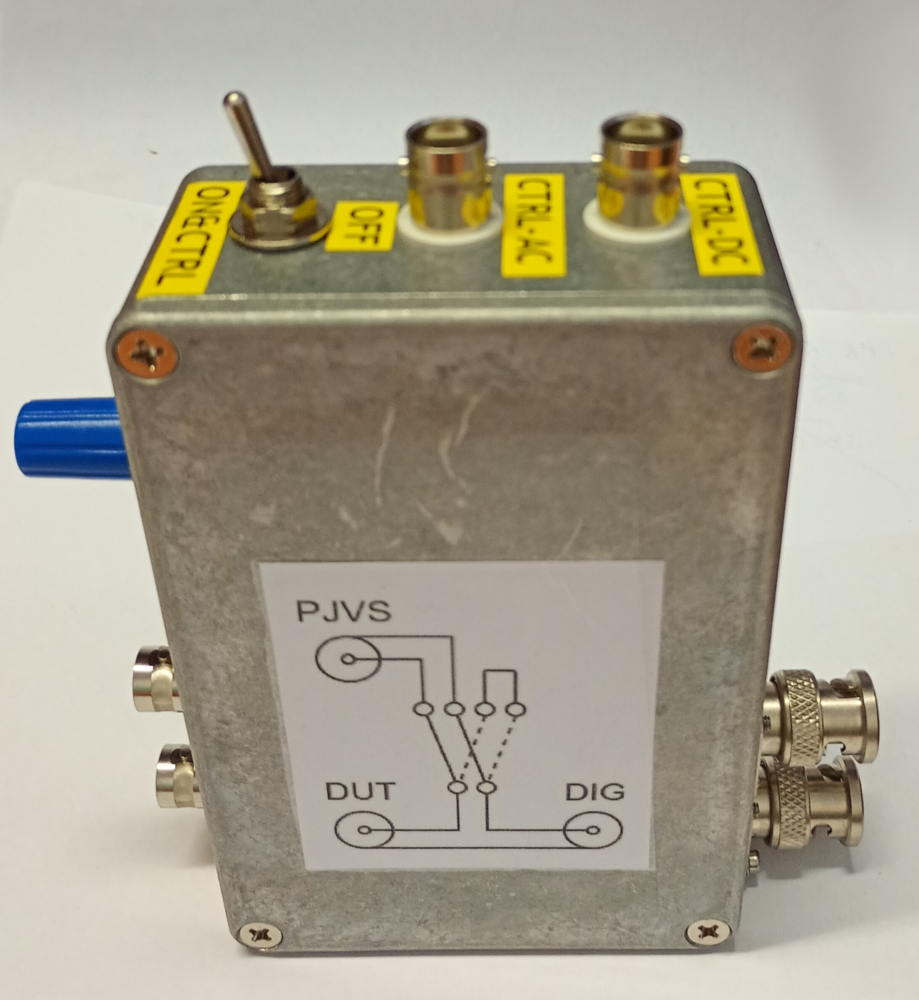
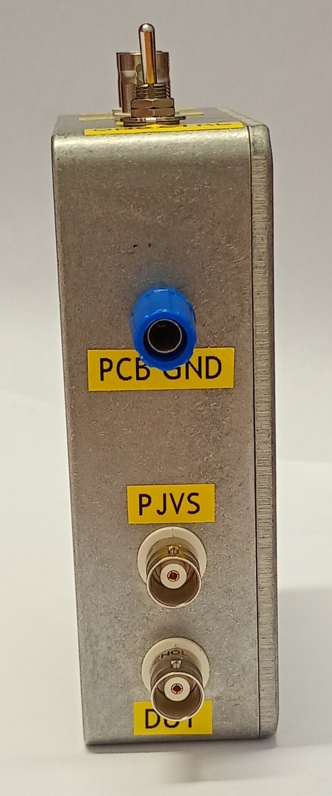
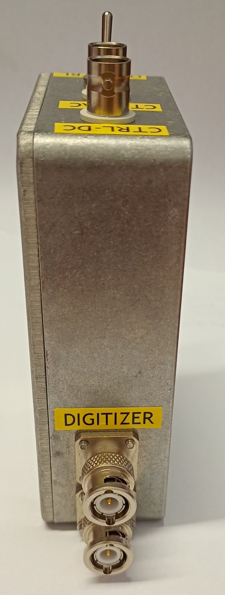
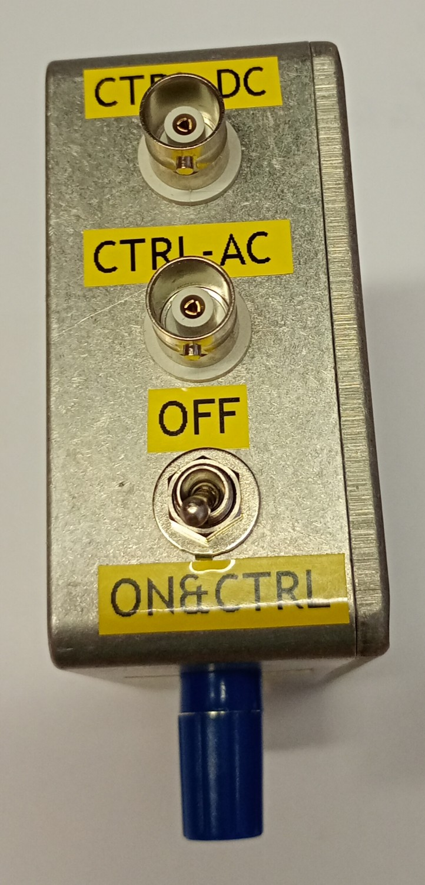
